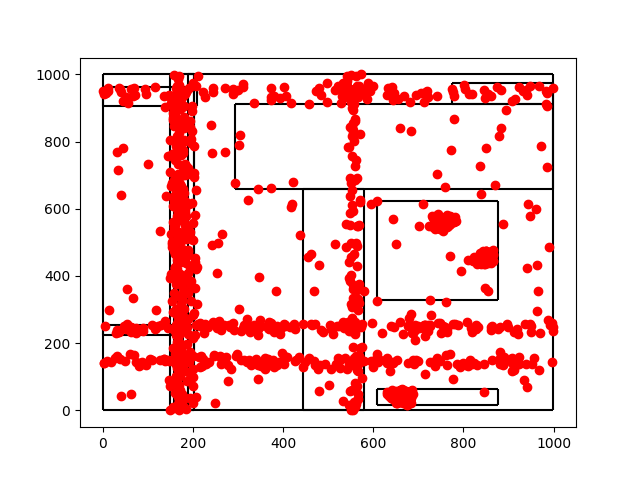
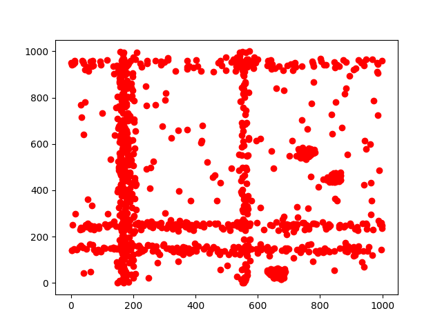

# Fast clustering Using Decision Tree
Rohan Raj (150107048) & Lavish Maheswari (150122021)
### Abstract
Clustering is widely used in unsupervised machine learning to separate data.We will use a new  clustering technique, which is based on a supervised learning technique called decision tree construction.The main idea is to use a decision tree to partition the data space into cluster and sparse regions.First, new data points are introduced into the space and then a modified decision tree algorithm is applied.This method works well for large high dimensional
spaces efficiently.
time complexity of O(N 3 ). In this project our aim is to develope a fast clustering mechanism for binary separation of data at nodes of decision tree.

### Introduction

Decision tree learning is a supervised machine learning approach that uses a decision tree to go from decision on observation values(branches) to conclusion about item's target class (leaves) . Trees provides high accuracy, stability and ease of interpretation in classification problems. 
An example of a simple decision tree is shown by the following image.

	

A major question that comes in mind is how does a tree decide where to split. Decision tree uses multiple algorithms to decide the split in the
decision node. Commonly used algorithm in the decision tress measures Gini index, Chi-Square, Information gain or Reduction in Variance to decide 
the split in the decision node. However all of these algorithms have high time complexity. 	In this project we would like to extend hierarchical clustering
to decision tress for fast arrangement of data.

In this paper, we study clustering in a numerical space, where each di-mension (or attribute) has a bounded and totally ordered domain. Each data
record is basically a point in the space. Clusters in such a space are commonly
defined as connected regions in the space containing a relatively high density
of points, separated from other such regions by a region containing a relatively
low density of points

### Proposed Approach

The reason that this technique works is that if there are clusters in the
data, the data points cannot be uniformly distributed in the entire space.By adding some uniformly distributed N points, we can isolate the clusters
because within each cluster region there are more Y points than N points.
The decision tree technique is well known for this task.

1)  How many N points should we add, and 
(2) Can the same task be performed without physically adding the
    N points to the data?

The number changes as the tree grows. It is insufficient to add a fixed number of N
points to the original dataset at the beginning. The answer
to the second question is yes. Physically adding N points increases the size
of the dataset and also the running time.

The proposed CLTree technique consists of two steps:

1) Cluster tree construction: This step uses a modified decision tree algorithm
with a new purity function to construct a cluster tree to capture the
natural distribution of the data without making any prior assumptions.

2)Cluster tree pruning: After the tree is built, an interactive pruning step
is performed to simplify the tree to find meaningful/useful clusters. The
final clusters are expressed as a list of hyper-rectangular regions.

### Split using Information gain
The algorithm for building a decision tree typically uses the divide and
conquer strategy to recursively partition the data to produce the tree.

inf o X (D)

gain(X) = inf o(D) − inf o X (D) 

### Pruning 
There are basically two ways to produce simpler trees:

1. Stopping: deciding not to divide a region any further, or
2. Pruning: removing some of the tree parts after the tree has been built.

The user-defined two parameters used in pruning are as follows:
min y - t specifies the minimal number of Y points that a region must
 			contain
min rd - Relative density to choose if two clusters should be combined

### Dataset 

We have used a small dataset of size 804.
The number of attributes are 5 and user defined labels are 12.
with names {'100', '701', '101', '201', '200', '601', '501', '401', '300', '301', '302', '-1'}

### Results 

The results are obtained with descriptions about the split of subset, number of
misclassifications, relative density and the features responsible for cuts.

With cluster Image : 

	

Without cluster Image : 

	

Cluster 0
Node: 
29 instances, 0 misclassified, 100% 701, 100 relative density 
Cuts {'dim3', 'dim2', 'dim4', 'dim0', 'dim1'}

Cluster 1
Node: 
19 instances, 0 misclassified, 100% 301, 100 relative density 
Cuts {'dim3', 'dim2', 'dim0', 'dim1'}

Cluster 2
Node: 
22 instances, 0 misclassified, 100% 200, 100 relative density 
Cuts {'dim3', 'dim2', 'dim4', 'dim0', 'dim1'}

Cluster 3
Node: 
22 instances, 0 misclassified, 100% 200, 100 relative density 
Cuts {'dim3', 'dim2', 'dim4', 'dim0', 'dim1'}

Cluster 4
Node: 
19 instances, 0 misclassified, 100% 201, 32 relative density 
Cuts {'dim3', 'dim2', 'dim0', 'dim1'}

Cluster 5
Node: 
19 instances, 0 misclassified, 100% 201, 59 relative density 
Cuts {'dim3', 'dim2', 'dim0', 'dim1'}

Cluster 6
Node: 
17 instances, 1 misclassified, 94% 701, 100 relative density 
Cuts {'dim0', 'dim4', 'dim2', 'dim3', 'dim1'}

Cluster 7
Node: 
273 instances, 117 misclassified, 57% 100, 100 relative density 
Cuts {'dim3', 'dim4', 'dim0', 'dim1'}

Cluster 8
Node: 
151 instances, 0 misclassified, 100% 501, 100 relative density 
Cuts {'dim3', 'dim4', 'dim0', 'dim1'}

Cluster 9
Node: 
27 instances, 0 misclassified, 100% 601, 100 relative density 
Cuts {'dim3', 'dim2', 'dim4', 'dim0', 'dim1'}

Cluster 10
Node: 
33 instances, 16 misclassified, 51% 302, 13 relative density 
Cuts {'dim3', 'dim4', 'dim0', 'dim1'}

Cluster 11
Node: 
24 instances, 0 misclassified, 100% 301, 63 relative density 
Cuts {'dim3', 'dim2', 'dim4', 'dim0', 'dim1'}

Cluster 12
Node: 
149 instances, 1 misclassified, 99% 401, 100 relative density 
Cuts {'dim3', 'dim4', 'dim0'}

### References 

1. C. Aggarwal, C. Propiuc, J. L. Wolf, P. S. Yu, and J. S. Park (1999) A frame-
work for finding projected clusters in high dimensional spaces, SIGMOD-99
2. C. Aggarwal, and P. S. Yu (2000) Finding generalized projected clusters in high
dimensional spaces, SIGMOD-00
3. R. Agrawal, J. Gehrke, D. Gunopulos and P. Raghavan (1998) Automatic
subspace clustering for high dimensional data for data mining applications,
SIGMOD-98
4. R. Agrawal, S. Ghosh, T. Imielinski, B. Lyer, and A. Swami (1992) In interval
classifier for database mining applications, VLDB-92.
5. P. Arabie and L. J. Hubert (1996) An overview of combinatorial data analysis,
In P. Arabie, L. Hubert, and G.D. Soets, editors, Clustering and Classification,
pages 5-63
6. K. Beyer, J. Goldstein, R. Ramakrishnan and U. Shaft (1999) When is nearest
neighbor meaningful?” Proc.7th Int. Conf. on Database Theory (ICDT)
7. P. Bradley, U. Fayyad and C. Reina (1998) Scaling clustering algorithms to
large databases, KDD-98
8. C. H. Cheng, A. W. Fu and Y Zhang. ”Entropy-based subspace clustering for
mining numerical data.” KDD-99
9. R. Dubes and A. K. Jain (1976) Clustering techniques: the user’s dilemma,
Pattern Recognition, 8:247-260
10. M. Ester, H.-P. Kriegal, J. Sander and X.